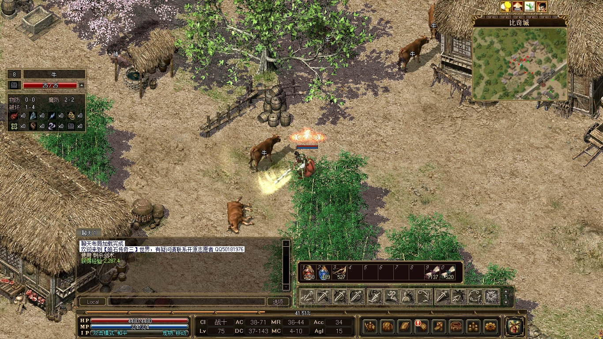
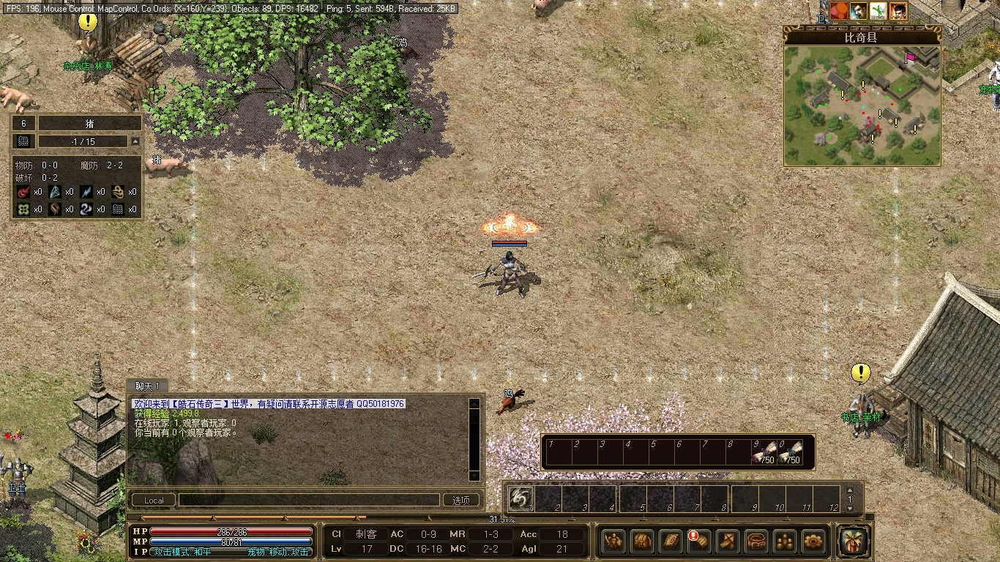
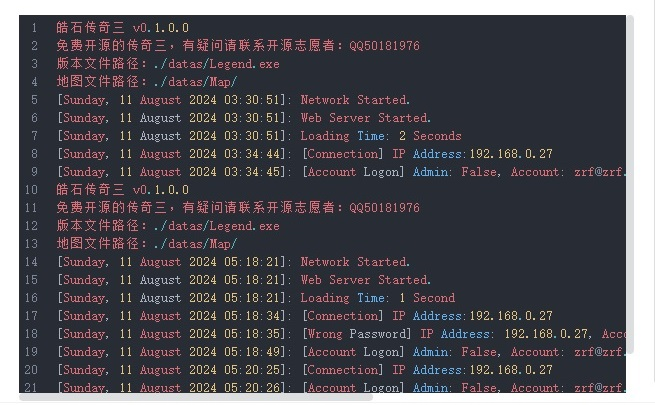
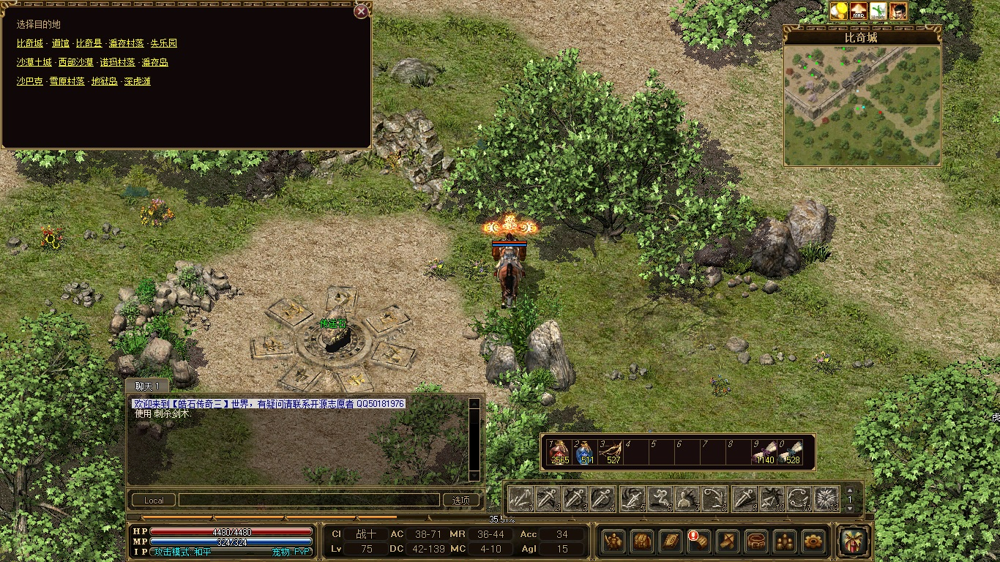

# 皓石传奇三  Zircon Mir3

本开源项目仅供学习游戏技术，禁止商用以及非法用途。

## 简介

### 完整的传奇三游戏

- 含了四个职业：战士、法师、道士、刺客 
 
 
 
	
- 技能丰富，平均每个职业有 38 个技能 
 

- 地图和道具及其丰富，玩到 100级没压力；

- 技能正常修炼到 3级以后，还可通过打出高等级技能书一直升到 6级；

- 武器和首饰均可精炼，品质高的装备精炼上限也更高；

- 法师招宠与道士的宠物最高可升至暗金等级，各项属性翻倍，非常实用；

- 刺杀剑术破防之余，技能等级越高，刺杀剑术的攻速越快，爽之又爽；

### 支持多平台部署

服务端支持在 Linux、Windows、Docker 平台上部署。

 
	
### 便捷传送

每个传送石都可以方便地传送到任意地图。 

 

## 服务器 部署指南

参见项目 【[ZirconLegend-Server](https://gitee.com/raphaelcheung/zircon-legend-server)】

## 客户端 运行指南

参见项目 【[ZirconLegend-Client](https://gitee.com/raphaelcheung/zircon-legend-client.git)】

## 客户端启动器 运行指南

从本项目 [发布页面](https://gitee.com/raphaelcheung/zircon-legend-launcher/releases) 下载最新运行文件。

把运行文件放入客户端根目录下后，直接运行即可。

## 代码编译

开发环境依赖：

- Microsoft Visual Studio Community 2022

- .Net Framework 4.8

安装这些后拉取全库代码，直接编译即可。